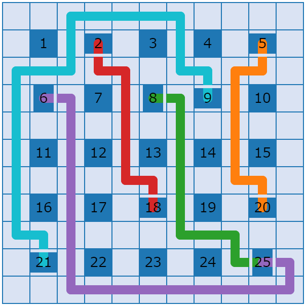

# Lattice Surgery Visualizer



## Overview

Visit here:

https://quantum-programming.github.io/lattice_surgery_visualizer/

This is a visualizer for lattice surgery.

Usage of this visualizer will be published after our paper is published.

## For developers

In order to build this app, you need to have the following environment:

- Rust execution environment
- [wasm-pack](https://developer.mozilla.org/ja/docs/WebAssembly/Rust_to_Wasm)
- node execution environment
- yarn

To prepare these, you need to run the following commands:

```bash
cargo install wasm-pack
npm install -g yarn
```

At the first time, please run the following commands:

```bash
yarn  # Install node modules
cd wasm && wasm-pack build --target web --out-dir ../public/wasm && cd .. # Rust to wasm
yarn dev # Run the server
```

Then, the web app will be hosted on your local machine. Please access the URL displayed on the console. You will see the visualizer in the initial state.

## For GitHub Pages

```bash
npm run build
npm run deploy
```

## LICENSE

This software is released under the MIT License, see [LICENSE](./LICENSE).

## Acknowledgement

This visualizer is based on [visualizer-template-public](https://github.com/yunix-kyopro/visualizer-template-public) by [yunix-kyopro](https://github.com/yunix-kyopro).

Please also refer [this cite](https://yunix-kyopro.hatenablog.com/entry/2023/12/17/150534) (Japanese) for the details of the template.
